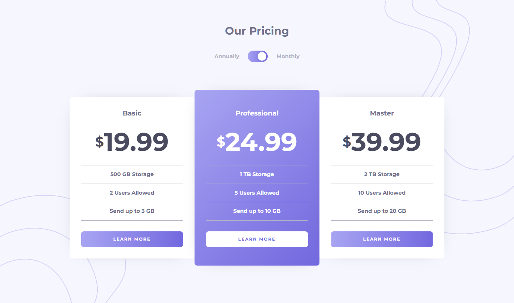

# Frontend Mentor - Pricing component with toggle solution

This is a solution to the [Pricing component with toggle challenge on Frontend Mentor](https://www.frontendmentor.io/challenges/pricing-component-with-toggle-8vPwRMIC). Frontend Mentor challenges help you improve your coding skills by building realistic projects. 

## Table of contents

- [Overview](#overview)
  - [The challenge](#the-challenge)
  - [Screenshot](#screenshot)
  - [Links](#links)
- [My process](#my-process)
  - [Built with](#built-with)
  - [What I learned](#what-i-learned)
  - [Continued development](#continued-development)
  - [Useful resources](#useful-resources)
- [Author](#author)

## Overview

### The challenge

Users should be able to:

- View the optimal layout for the component depending on their device's screen size
- Control the toggle with both their mouse/trackpad and their keyboard
- **Bonus**: Complete the challenge with just HTML and CSS

### Screenshot

### Links

- HTML Solution URL: [HTML](https://github.com/JustANipple/pricing-component-with-toggle/blob/main/index.html)
- Plan JSX Solution URL: [PLAN](https://github.com/JustANipple/pricing-component-with-toggle/blob/main/src/components/Plan/Plan.jsx)
- Live Site URL: [LIVE](https://pricing-component-with-toggle-justanipple.vercel.app)

## My process

### Built with

- Semantic HTML5 markup
- CSS custom properties
- Flexbox
- CSS Grid
- Mobile-first workflow
- [React](https://reactjs.org/) - JS library

### What I learned

I learned prop drilling to pass switch "checked" state to plan components

### Continued development

I will be working on React to improve with Hooks, state, components and more

### Useful resources

- [React](https://react.dev/learn) - Learn react while building solutions

## Author

- Frontend Mentor - [@JustANipple](https://www.frontendmentor.io/profile/JustANipple)